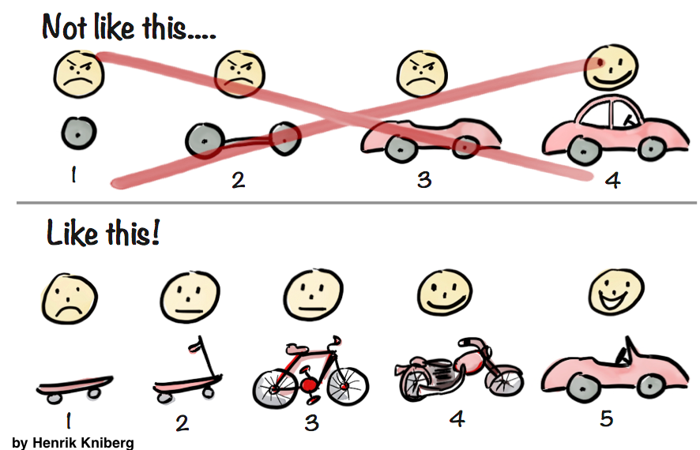

### 포스텍

[포스텍 영재기업인교육원](https://ceo.postech.ac.kr)은 중2 때 지원하여 중3, 고1 총 2년간 활동한 교육원이다. 창업을 하는 것이 꿈인 나에게 기업가 정신과 같은 사업과 창업에 필요한 여러 지식을 알려준 곳이다. 물론 여기서 만난 사람들도 나에게 꽤나 소중한 인연이 되었다. 이 영재원 이후 나는 어떠한 문제를 직면했을 때 "어? 이렇게 하면 문제를 해결하여 사업을 할 수 있지 않을까?"를 생각하는 게 습관이 되었고, 그런 습관으로 기록한 메모가 프로젝트를 주제를 고민할 때 큰 도움이 되고 있다.

이런 습관 외에도 얻은 것은 분명 많지만 많은 부분을 기억을 하지 못하고 있다. 그리하여 내가 프로젝트를 설계, 진행하는데 있어 유용할 것 같은 포스텍에서 배운 개념과 지식, 태도를 정리하려 한다.

### 린 캔버스

Lean Canvas는 빠르게 스타트업에 필요한 요소들을 정리할 수 있게 해주는 모델 기획 캔버스이다. Lean Canvas의 장점은 다음과 같다.

1. 초기 사업에 필요한 요소를 빠짐없이 빠르게 구성할 수 있다.
2. 다른 부수적인 내용을 제외하고 빠르게 핵심적인 MVP를 제작할 수 있다.
3. 사업의 가능성을 판단하고 Piovt기법을 통해 방향을 신속히 바꿀 수 있다. 
4. 한 장에 모든 내용을 정리하여 사업 설계를 한 눈에 볼 수 있다.

이러한 Lean Canvas는 사업의 가능성을 파악하는데 아주 요긴하여, 실제 사업 기획 발표에 쓰이기도 한다.   
### MVP

위에서도 언급된 MVP는 Minimum Viable Product의 약자로, 최소 기능 제품을 의미한다. MVP는 일단 신속하게 최소한의 기능을 하는 제품를 제작하여 경험하고 발전시킬 수 있게 해준다. 여기서 최소한의 기능은 이 제품의 핵심적인, 즉 가치가 되는 기능을 말한다. 구글에 비유하면, 구글은 지메일, 지도, 캘린더, 에즈, 애널리틱스 등 여러 서비스를 가지고 있지만 구글 MVP는 단연 검색이었을 것이다. 먼저 검색 기능을 구현하고, 부가적인 것들은 사업을 진행하고 고객의 반응 보면서 개발하는 것이 더 효율적이고 성공 가능성이 높으며 본래 가치를 잊는 않는 방법이다. 다음은 MVP의 장점이다.

1. 고객 반응을 빠르게 확인할 수 있다.
2. 기획한 제품의 본질을 지킬 수 있다.

특히 이렇게 빠르게 제품을 제작하여 시장에 내놓으면, 그때 제품의 본질에 반응하는 사람들이 있으면 그들이 자연스럽게 아이디어를 내놓을 것이다. 그럼 그때 그 기능들을 추가해 나가면 되는 것이다.