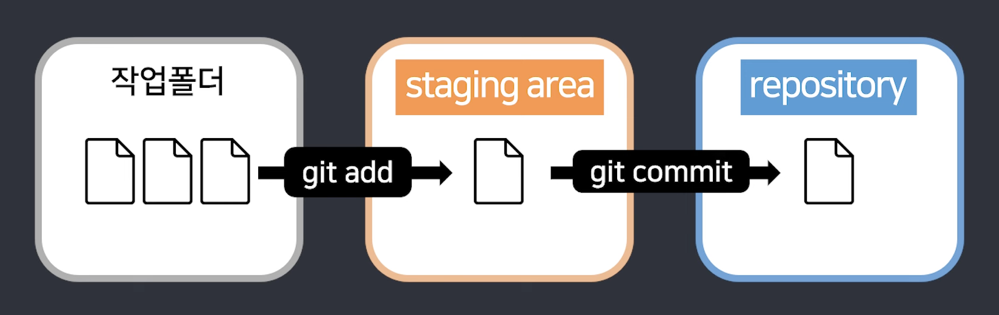
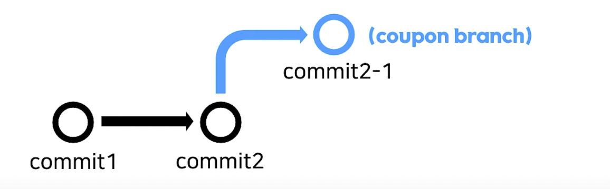

### 시작: 애매함을 확실하게 

버전 관리 시스템은 코드의 수정본을 저장을 해준다. 개발의 방향을 잘못 잡아서 과거의 코드로 돌아갈 때 효과적으로 이용할 수 있다. 나 역시도 기록을 위해서 대표적인 버전 관리 시스템인 git을 사용하고 있다. 그러나 pull requests나 branch와 같은 것들은 정확히 의미도 모르고 그저 commit만 해왔다. 이번 기회에 git의 세부적인 기능과 올바른 사용법에 대해 공부해보려 한다.

#### git add 파일이름

터미널에 위와 같이 입력하면 입력한 파일이 staging area(commit하기 이전의 상태)로 들어가게 된다. 이 기능을 통해 commit을 할 파일을 특정할 수 있다.

#### git commit -m '메모'

터미널에 위와 같이 입력하면 staging area의 파일을 repository로 업로드하는 하게 된다. 메모는 업로드를 설명하는 것으로 github에 같이 업로드 된다.

#### git diff / git difftool

어떤 것을 commit할 것인지 정할 때 달라진 점을 찾을 때 사용한다. 둘 다 터미널에서 작동하는 것인데 요즘은 vsc extenstion으로 시각적으로 보기에 훨씬 유용하여 GitLens나 Git History등으로 파일 간의 차이를 잘 파악할 수 있다.

#### git status

현재 branch의 위치, staging area의 상태, 수정된 파일 등을 보여준다.

#### git branch 이름

제일 최근 commit을 기준으로 새로운 branch를 만든다. 주로 새로운 기능을 추가할 때 오류로 인해 전체 프로그램이 작동이 안 될 때를 대비하여 복사본을 하나 만들 때 사용된다. 새로운 branch를 만들지 않아도 기본적으로 main/master branch로 설정된다.

#### git log

말 그대로 git을 한 log를 알 수 있다. 더 시각적으로 보고 싶으면 git log --oneline --all --graph를 입력하면 된다.

#### git switch 이름

이름이라는 branch로 이동할 수 있다.

#### git merge 이름

기준이 되는 branch로 이동하여 위 명령어를 입력하면, 현재 branch와 이름이라는 branch 합쳐진다. 서로 수정한 파일이 다른 경우에는 별 에러 없이 합쳐지지만, 서로 같은 파일의 같은 줄을 수정한 경우에는 conflict된다. 중복이 없게 수동으로 해결해야 한다.